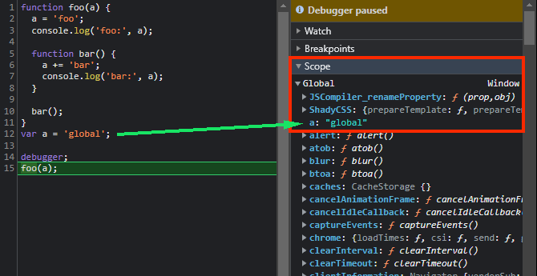
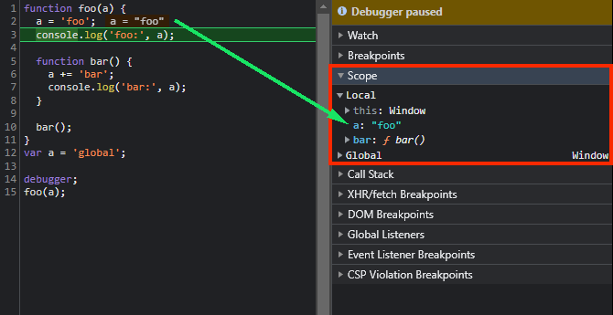
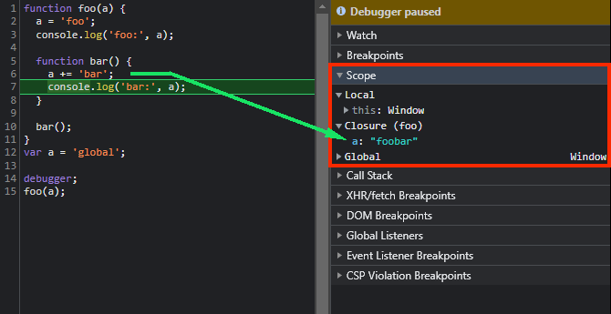

# 函式（Functions）

## 提升（Hoisting）

函式類似變數 `var` 的提升，但是是將函式的整體放到作用域的上面，如果函式名和變數名相同（純宣告沒有賦值），函式會覆蓋掉變數

```js
function a() {}
var a;
// var a = 123; // 因為賦值是在執行期間，所以會蓋掉變數和函式的宣告

console.log(a); // function a() {}   若是用 `var a = 123;` 則會印出 123
```

## 參數（Parameters）和引數（Arguments）

[MDN - The arguments object](https://developer.mozilla.org/en-US/docs/Web/JavaScript/Reference/Functions/arguments#rest_default_and_destructured_parameters) 說到：

> Non-strict functions that are passed only simple parameters (that is, not rest, default, or restructured parameters) will sync the value of variables new values in the body of the function with the arguments object, and vice versa

修改 `arguments[0]`：

```js
function test(a) {
  arguments[0] = '引數'; // updating arguments[0] also updates a
  console.log(a, arguments[0]); // 引數 引數
}

test(1);
```

反之修改 `a`：

```js
function test(a) {
  a = '參數'; // updating a also updates arguments[0]
  console.log(a, arguments[0]); // 參數 參數
}

test(1);
```

但是如果參數有預設值（default parameters）、其餘參數（rest parameter）或解構參數（destructured parameters）：

```js
function test(a = 'default') {
  a = '參數'; // updating a does not also update arguments[0]
  console.log(a, arguments[0]); // 參數 1
}

test(1);
```

```js
function test(a, ...rest) {
  arguments[0] = '引數'; // updating arguments[0] does not also update a
  console.log(a, arguments[0]); // 1 引數
}

test(1);
```

```js
function test({ a }) {
  arguments[0] = { a: '引數' }; // updating arguments[0] does not also update a
  console.log(a, arguments[0]['a']); // 1 引數
}

test({ a: 1 });
```

可以用以下方式查看函式的資訊：

```js
var func = function func2(a, b) {
  console.log('函式名稱：', func.name); // func2
  console.log('參數（parameters）數量：', func.length); // 2
  console.log('引數（arguments）數量：', arguments.length); // 3
};

func(1, 2, 3);
```

也可以用函式自帶的 `caller` 以及自動傳入函式的 `arguments.callee` 來得到資訊（`'use strict';` 嚴格模式下無法使用）：

```js
var test1 = function test2() {
  console.log('我是誰？：', arguments.callee);
  console.log('誰呼叫了我？：', test2.caller);
};

function caller() {
  test1();
}

caller();
```

## 作用域（Scope）和作用域鏈（Scope Chain）

若要理解閉包（Closure），就得了解作用域（Scope）和其產生的相關知識，如此一來就得了解一下 EC、VO（GO、AO） 了。

### EC（Execution Context）

EC 是 JavaScript 執行一段可執行程式碼時所建立的環境，分為全域（Global）EC 和函式（Function）EC 兩種。每個 EC 都有一個相關的 VO（Variable Object），在查找變數、函式時，會先查看當前 EC 的 VO，若沒找到就會到更外層 EC 的 VO 查看，而這樣多個 EC 的 VO 鏈結而成的串列就叫「作用域鏈（Scope Chain）」。

### VO（Variable Object）

每個 EC 都有一個相關的 VO，它用來儲存 EC 上的變數和函式。全域 EC 的 VO 就是 **GO（Global Object）**，在瀏覽器中就是 window 物件；而函式 EC 的 VO 則稱為 **AO（Activation Object）**。

### GO (Global Object)

全域執行環境（Global Execution context）

建立的流程：

1. 建立 GO 物件（當全域執行的前一刻）

2. 尋找變數宣告，將變數**宣告**作為 GO 的屬性名（property name）

3. 尋找函式**宣告**／**定義**，將函式名作為 GO 的屬性名，函式本身作為屬性值（property value）。不包含函式表達式（function expression）

4. 執行，進行變數**定義**（**賦值**）

```js
console.log(a);
a = 1;
console.log(a);
var a;
function a() {}
console.log(b);
var b = function () {};
console.log(b);
```

最後 Global EC 的 GO：

```js
/* pseudo code */
globalEC = {
  GO: {
    ...
    a: 1, // undefined -> function a() {} -> 1
    b: function () {}, // undefined -> function () {}
  },
};
```

### AO (Activation Object)

函式執行環境（Function execution context）

建立的流程：

1. 建立 AO 物件（當函式被執行的前一刻）

2. 尋找參數（parameter）和變數**宣告**，將參數、變數宣告作為 AO 的屬性名（property name）

3. 將引數（argument）和參數（parameter）統一

4. 尋找函式**宣告**／**定義**，將函式名作為 AO 的屬性名，函式本身作為屬性值（property value）。不包含函式表達式（function expression）

5. 執行，進行變數**定義**（**賦值**）

```js
function aoTest(a, b) {
  console.log(a);
  arguments[0] = 123; // 和 a 有特殊的映射關係
  console.log(a);
  function a() {}
  console.log(a);
  console.log(b);
  b = function () {};
  console.log(b);
}

aoTest(1);
```

最後 aoTestEC 的 AO：

```js
/* pseudo code */
aoTestEC = {
  AO: {
    this: window,
    arguments: [array - like],
    a: 123, // undefined -> function a() {} -> 123
    b: function () {}, // undefined -> function () {}
  },
};
```

### 作用域鏈（Scope Chain）

建立過程：

- 當「全域執行的前一刻」會產生 GO，然後將 GO 放到 scopeChain 中。

- 當「函式被定義時」它內部的隱藏屬性 `[[Scope]]` 會產生作用域鏈（Scope Chain），而作用域鏈一開始的第 `0` 位會存放全域的 GO。

- 當「函式被執行的前一刻」會建立該函式的 AO，此時新的作用域鏈第 `0` 位會變為這個 context 的 AO，然後外層 context 的 VO／AO 變為第 `1` 位，以此類推，所以查找變數會先從 AO 開始，然後依序查找到 GO。

- 當「函式執行結束後」一般情況會銷毀自己的 AO，`[[Scope]]` 回到「函式被定義時」的狀態。

Chrome DevTools 模擬：

```js
function foo(a) {
  a = 'foo';
  console.log('foo:', a);

  function bar() {
    a += 'bar';
    console.log('bar:', a);
  }

  bar();
}
var a = 'global';

debugger;
foo(a);
```

(1)


(2)


(3)


`bar` 的作用域鏈（Scope Chain）會保存 `foo` 的 AO （Activation Object），當 `bar` 執行後，會產生它自己的 AO 並放在作用域鏈的首位，其他 AO 和 GO 向後依序排列，因此可以訪問到其它 context 的變數。

#### 詳細模擬 GO & AO 建立的過程

```js
a = 1;

function test(e) {
  function e() {}
  arguments[0] = 2;
  console.log(e);
  if (a) {
    var b = 3;
  }

  var c;
  a = 4;
  var a;
  console.log(b);
  f = 5;
  console.log(c);
  console.log(a);
}

var a;

test(1);

console.log(a);
console.log(f);
```

GO - 建立 GO 物件、尋找變數宣告：

```js
// 建立 GO 物件
GO = {
  // 尋找變數宣告
  a: undefined,
};
```

GO - 尋找函式宣告：

```js
GO = {
  a: undefined,

  // 尋找函式宣告
  test: function test(e) {
    /* ... */
  },
};
```

GO - 執行，進行變數定義、賦值：

```js
GO = {
  /* 執行，進行變數定義、賦值 */

  a: 1,
  test: function test(e) {
    /* ... */
  },
};
```

AO - 建立 AO 物件並尋找參數、變數宣告：

```js
GO = {
  a: 1,
  test: function test(e) {
    /* ... */
  },
};

// 建立 AO 物件
AO = {
  // 尋找參數、變數宣告
  e: undefined,
  b: undefined, // 注意：此時無視 if
  c: undefined,
  a: undefined,
};
```

AO - 引數和參數統一：

```js
GO = {
  a: 1,
  test: function test(e) {
    /* ... */
  },
};

AO = {
  // 引數和參數統一
  e: 1,
  b: undefined,
  c: undefined,
  a: undefined,
};
```

AO - 尋找函式宣告：

```js
GO = {
  a: 1,
  test: function test(e) {
    /* ... */
  },
};

AO = {
  // 尋找函式宣告
  e: function e() {},
  b: undefined,
  c: undefined,
  a: undefined,
};
```

AO - 執行，進行變數定義、賦值：

```js
GO = {
  a: 1,
  test: function test(e) {
    /* ... */
  },
  f: 5, // AO 沒有 f 變數，所以到 GO 建立（未進行變數宣告的特性）
};

AO = {
  /* 執行，進行變數定義、賦值 */

  e: 2, // arguments[0] = 2
  b: undefined, // 此時的 a 為 undefined，故 b 不被賦值
  c: undefined,
  a: /* undefined */ 4,
};
```

最終結果：

```bash
2
undefined
undefined
4
1
5
```

<!-- 小心 Format（Shift+Alt+F）會破壞格式 -->

## 立即執行函式（Immediately Invoked Functions Expressions, IIFEs）

- 自動執行並在完成後銷毀、釋放記憶體（一般函式宣告會保存在 GO 中）

- 產生獨立的函式作用域，不汙染全域，有利於封裝、模組化等等

```js
// 寫法一
(function () {
  console.log('IIFE 01');
})();

// 寫法二
(function () {
  console.log('IIFE 02');
}());
```

失敗：

```js
function test1() {}() //Uncaught SyntaxError: Unexpected token ')'
```

相當於：

```js
function test1() {}
() // 突然出現一個 () 於是報錯
```

成功：

```js
var test2 = function () {
  console.log('若為表達式（express）就能被執行');
}();
```

除了用小括號 `()`（parentheses）將函式包住，還有什麼方法可以讓函式宣告變成表達式呢？：

```js
// 注意：雖然轉換為表達式就可執行，但函式的名稱（宣告）則會無效，所以不能被呼叫
false ||
  function test2() {
    console.log('在 function 前加上 + - ! ~ || && 等等就能做到');
  }();

test2(); // Uncaught ReferenceError: test2 is not defined
```

多傳上引數，JS 引擎就會認為 `(123)` 是表達式，所以不報錯，但仍然不執行：

```js
function test3() {
  console.log('不會執行。(123) 是表達式；而只有 () JS 引擎看不懂，報語法錯誤');
}(123);
```

延伸的其他知識：

```js
var a = 123;

// 注意： 括起來後變成表達式，函式的名稱（宣告）會無效
if (function b() {}) {
  a += typeof b;
}

console.log(a);
```

.

.

.

.

.

```bash
123undefined
```

函式不是 falsy，會進到 `if` 裡，但函式被 `()` 括起來，變為表達式，因此函式的名稱（宣告）也就無效了，最終 `typeof` 回傳 `'undefined'` 加到 `123` 後面，印出 `'123undefined'`。

## 閉包（Closure）

閉包跟作用域鏈息息相關，以實用面來說，指的一個函式它所在的 context 已經銷毀了，但是它還引用著被銷毀的 context 之變數。

- 所以當「主函式」執行後，它的「內部函式」被回傳到外部並被保存住時，就會產生閉包。

- 換句話說就是當一個函數定義的作用域和執行的作用域不同時，就會形成閉包。


### 閉包模擬流程（瀏覽器環境）

```js
function test1() {
  function test2() {
    console.log(a);
  }
  var a = 'test1 的變數 a';
  return test2;
}

var c = 0;
var test3 = test1();

test3();
```

全域 EC 建立的 GO：

| Name     | Value                   |
| -------- | ----------------------- |
| ...      | ...                     |
| this     | window                  |
| window   | [object]                |
| document | [object]                |
| c        | 0                       |
| test1    | function test1() {}     |
| test3    | function **test2**() {} |

當函式 `test1` 被定義時，產生它的作用域鏈：

| test1     | Scope Chain |
| --------- | ----------- |
| [[Scope]] | GO          |

當函式 `test1` 被執行後，產生自己的 AO 並存至新的作用域鏈的首位：

| test1     | Scope Chain      |
| --------- | ---------------- |
| [[Scope]] | AO (`test1`)、GO |

函式 `test1` EC 建立的 AO：

| Name      | Value               |
| --------- | ------------------- |
| this      | window              |
| arguments | [array-like]        |
| a         | 'test1 的變數 a'    |
| test2     | function test2() {} |

當函式 `test2` 被定義時，產生和上級 `test1` 一樣的作用域鏈：

| test2     | Scope Chain      |
| --------- | ---------------- |
| [[Scope]] | AO (`test1`)、GO |

當函式 `test2` 被執行後，產生自己的 AO 並存至作用域鏈的首位：

| test2     | Scope Chain                    |
| --------- | ------------------------------ |
| [[Scope]] | AO (`test2`)、AO (`test1`)、GO |

函式 `test2` EC 建立的 AO：

| Name      | Value        |
| --------- | ------------ |
| this      | window       |
| arguments | [array-like] |

當函式 `test1` 執行完後的作用域鏈：

| test1     | Scope Chain          |
| --------- | -------------------- |
| [[Scope]] | ~~AO (`test1`)~~、GO |

函式 `test1` 執行完後，回傳函式 `test2` 到變數 `test3`，此時函式 `test1` 的 Scope Chain 切斷和自己 AO 的連結（回到函式 `test1` 被定義時的狀態），但不能直接回收 AO 的記憶體，因為函式 `test2` 還在使用它，這時候就形成了「閉包（Closure）」。

當函式 `test2` 執行完後，它的 Scope Chain 也會切斷和自己 AO 的連結，但是仍然存著函式 `test1` 的 AO 和 GO，若再次執行則會重新生成自己的 AO。

> 閉包會保留著它外層 context 的 AO，因此過度使用閉包可能會導致記憶體流失（memory leak）或是載入變慢。

## 函式的方法

### `call` & `apply` & `bind`

影響 this 指向的優先權測試：

```js
function Car(brand, color) {
  this.brand = brand;
  this.color = color;

  if (!new.target) {
    return this;
  }
}

var myCar = {
  license: 'ABC-123',
};

var boundCar = Car.bind(myCar);

/* 如果綁定時就放入全部或部分的引數 */
var boundCar = Car.bind(myCar, 'Toyota');

var car1 = boundCar('Ferrari', 'white');
console.log('car1 (bind):', car1);
// {license: 'ABC-123', brand: 'Ferrari', color: 'white'}

var car2 = boundCar.call({ license: 'XYZ-456' }, 'BMW', 'blue');
console.log('car2 (call):', car2);
// {license: 'ABC-123', brand: 'BMW', color: 'blue'}

var car3 = boundCar.apply({ license: 'XYZ-456' }, ['BMW', 'green']);
console.log('car3 (apply):', car3);
// {license: 'ABC-123', brand: 'BMW', color: 'green'}

var car4 = new boundCar('Tesla', 'silver');

/* 忽略全部或部分的引數，不過 this 還是指向全新的物件 */
var car4 = new boundCar('silver');
// {brand: 'Toyota', color: 'silver'}

console.log('car4 (new):', car4);
// {brand: 'Tesla', color: 'red'}
```

由上方例子可知 `new` 關鍵字的優先權較高，接著是 `bind`，然後才是 `call` 跟 `apply`，`call` 跟 `apply` 可以說是相同的東西（只是引數填入的形式不同），最後是一般的函式（隱性綁定，取決於如何呼叫的）。

另外 ES6 的箭頭函式（Arrow function）擁有更高的優先權，它沒有自己的 `this`，箭頭函式的 `this` 取決於定義時的 context，因此 `bind`、`call` 和 `apply` 之類的方法不能改變其 `this` 的指向；而且箭頭函式沒有 `new`、`arguments` 和 `super` 等語法，所以也不能當作建構器（Constructor）來使用。

<!-- TODO -->

## 偏函式應用（Partial Application）

## 柯里化（Currying）函式

```js
// 增強函式的通用性
function currying(fn) {
  var args = [];

  return function curried() {
    args = args.concat(Array.from(arguments));

    if (args.length >= fn.length) {
      return fn.apply(null, args);
    }

    return curried;
  };
}

/* -------------------- 分隔線 -------------------- */

function isType(type, value) {
  return Object.prototype.toString.call(value) === `[object ${type}]`;
}

// var isString = currying(isType)('String');
// console.log('isString:', isString('hello'));

var typeUtil = {};
[
  'String',
  'Number',
  'Boolean',
  'Object',
  'Array',
  'Function',
  'Null',
  'Undefined',
].forEach(function (type) {
  typeUtil['is' + type] = currying(isType)(type);
});

console.log('isString:', typeUtil.isString('hello'));
```

## 重組（Compose）函式

---

參考資料：

- [MDN - Functions](https://developer.mozilla.org/en-US/docs/Web/JavaScript/Reference/Functions)

- [MDN - Arrow function expressions](https://developer.mozilla.org/en-US/docs/Web/JavaScript/Reference/Functions/Arrow_functions)

- [JavaScript 深入之变量对象 #5](https://github.com/mqyqingfeng/Blog/issues/5)

- [JavaScript 深入之作用域链 #6](https://github.com/mqyqingfeng/Blog/issues/6)

<!-- 生成 AST： https://resources.jointjs.com/demos/javascript-ast -->
