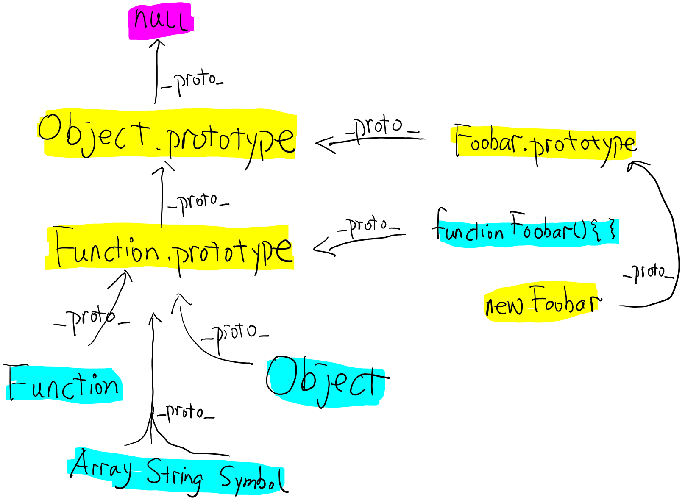

<!-- Function.prototype questions -->

https://stackoverflow.com/questions/32928810/function-prototype-is-a-function

https://stackoverflow.com/questions/4859308/in-javascript-why-typeof-function-prototype-is-function-not-object-like-ot

https://github.com/creeperyang/blog/issues/9

https://github.com/jawil/blog/issues/13

```js
/* 釐清 */

function Person() {}

Person.__proto__ === Function.prototype;

Person.__proto__.constructor === Function;

Person.prototype.__proto__ === Object.prototype;

typeof Person.prototype({}).__proto__ === Object.prototype;
```

實例後，再重新給 Car 的原型物件一個新物件，不會影響實例上的 `[[Prototype]]`（`__proto__`），因為實際上改的是 `Car.prototype`，而實例上的 `[[Prototype]]` 指向的是舊物件 reference

```js
function Car() {}

Car.prototype.brand = 'Benz';

var car1 = new Car();

Car.prototype = {
  constructor: Car, // 建構函式預設屬性
  brand: 'Mazda',
};

console.log(car1.brand); // Benz
```



```js
Object.__proto__ === Function.prototype;

String.__proto__ === Function.prototype;

Number.__proto__ === Function.prototype;

Function.__proto__ === Function.prototype;

Function.prototype.__proto__ === Object.prototype;
```

修改 prototype 的屬性（property）

```js
function Professor() {
  this.age = 50;
}
Professor.prototype.pSkill = 'C/C++';
var professor = new Professor();

function Teacher() {
  this.tSkill = 'JavaScript';
  this.age = 40;
  this.obj = {
    a: 123,
  };
}
Teacher.prototype = professor;
var teacher = new Teacher();

function Student() {
  this.sSkill = 'VB';
}
Student.prototype = teacher;
var student = new Student();
student.age = student.age - 18; // 當原型物件的屬性值為 Primitive 型別時，透過實例物件修改屬性值「不會引起」原型物件的屬性值發生變化
student.obj['a'] = 456; // 當原型物件的屬性值為 Reference 型別時，透過實例物件修改屬性值就「可能引起」原型物件的屬性值發生變化

student.obj = {
  a: 789,
};

console.log(student);
```

嘗試自製 `new`：

```js
function myNew(Constructor) {
  var myThis = {
    __proto__: Constructor.prototype,
  };

  var args = Array.from(arguments);
  args.shift();

  console.log('log:', args, arguments);

  var result = Constructor.apply(myThis, args);

  return result instanceof Object ? result : myThis;
}

function Car(color, brand) {
  this.color = color;
  this.brand = brand;
}

var myInstance = myNew(Car, 'black', 'Benz');
```

參考

- [Shubo 的程式開發筆記 - JavaScript Prototype (原型) 是什麼？](https://shubo.io/javascript-prototype/#javascript-prototype-%E5%8E%9F%E5%9E%8B)
