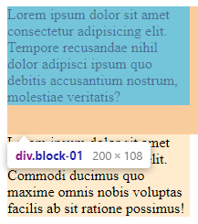
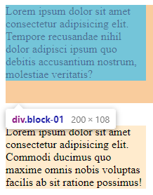

# FC（Formatting Context）

HTML 元素都是 box，`div`、`p`、`h1` 等屬於 Block-level box，而 `a`、`span`、`img`等屬於 Inline-level box。

FC 是某種環境，它決定內部 box 們的排版。不同的 FC 有各自的渲染規則，像是：

- BFC（Block Formatting Context）
- IFC（Inline Formatting Context）
- FFC（Flex Formatting Context）
- GFC（Grid Formatting Context）

## BFC（Block Formatting Context）

渲染規則：

- BFC 內部的 box 們會一個個垂直地排列

- box 垂直方向的距離由 `margin` 屬性而定

- 屬於同一個 BFC 中的兩個相鄰的 box 之間會產生 margin collasing 現象

- 況每一個 box 的左邊緣會碰觸 BFC 容器的左邊緣（預設 `direction` 屬性為 ltr 的情況），儘管存在 float 元素也是如此（float 元素）

實用面上 BFC 可以讓此 Block-level box 清除內部的 float，排除外部的 float，且不會發生 margin collapsing 的現象。

[MDN 上整理的建立 BFC 方式](https://developer.mozilla.org/en-US/docs/Web/Guide/CSS/Block_formatting_context)

由於 `<html>` 元素會建立一個 BFC（`<body>` 不會），所以一般情況內部 box 們都是在 `<html>` 元素的 BFC 中做排版。

因為兩個 `div` 是同一個 BFC 下的元素，會產生 margin collapsing：

```html
<html>
  <head>
    <style>
      .block-01 {
        width: 200px;
        margin-bottom: 32px;
        background-color: aquamarine;
      }

      .block-02 {
        width: 200px;
        margin-top: 32px;
        background-color: blanchedalmond;
      }
    </style>
  </head>
  <body>
    <div class="block-01">
      Lorem ipsum dolor sit amet consectetur adipisicing elit. Tempore
      recusandae nihil dolor adipisci ipsum quo debitis accusantium nostrum,
      molestiae veritatis?
    </div>
    <div class="block-02">
      Lorem ipsum dolor sit amet consectetur adipisicing elit. Commodi ducimus
      quo maxime omnis nobis voluptas facilis ab sit ratione possimus!
    </div>
  </body>
</html>
```

想要排除 margin collapsing 現象，於是讓 `class` 為 block-02 的元素建立新的 BFC：

```html
<html>
  <head>
    <style>
      .block-01 {
        width: 200px;
        margin-bottom: 32px;
        background-color: aquamarine;
      }

      .block-02 {
        width: 200px;
        margin-top: 32px;
        background-color: blanchedalmond;

        /* BFC */
        overflow: auto; /* 非 visible 或 clip 的值都可，而 auto 副作用較少*/
      }
    </style>
  </head>
  <body>
    <div class="block-01">
      Lorem ipsum dolor sit amet consectetur adipisicing elit. Tempore
      recusandae nihil dolor adipisci ipsum quo debitis accusantium nostrum,
      molestiae veritatis?
    </div>
    <div class="block-02">
      Lorem ipsum dolor sit amet consectetur adipisicing elit. Commodi ducimus
      quo maxime omnis nobis voluptas facilis ab sit ratione possimus!
    </div>
  </body>
</html>
```



發現沒有效果，margin collapsing 依然存在，雖然 block-02 建立一個新的 BFC 了，但這個 新的 BFC 還是需要排版，排版規則取決於它所在的 BFC，也就是 `<html>` 元素建立的，如果要讓 block-01 跟 block-02 所在的 BFC 不同，可以將 block-02 再包裝一層並設為新的 BFC：

```html
<html>
  <head>
    <style>
      .block-01 {
        width: 200px;
        margin-bottom: 32px;
        background-color: aquamarine;
      }

      .block-02 {
        width: 200px;
        margin-top: 32px;
        background-color: blanchedalmond;
      }

      .bfc {
        /* BFC */
        overflow: auto; /* 非 visible 或 clip 的值都可，而 auto 副作用較少*/
      }
    </style>
  </head>
  <body>
    <div class="block-01">
      Lorem ipsum dolor sit amet consectetur adipisicing elit. Tempore
      recusandae nihil dolor adipisci ipsum quo debitis accusantium nostrum,
      molestiae veritatis?
    </div>
    <div class="bfc">
      <div class="block-02">
        Lorem ipsum dolor sit amet consectetur adipisicing elit. Commodi ducimus
        quo maxime omnis nobis voluptas facilis ab sit ratione possimus!
      </div>
    </div>
  </body>
</html>
```


